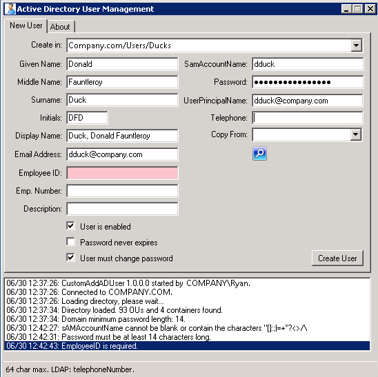
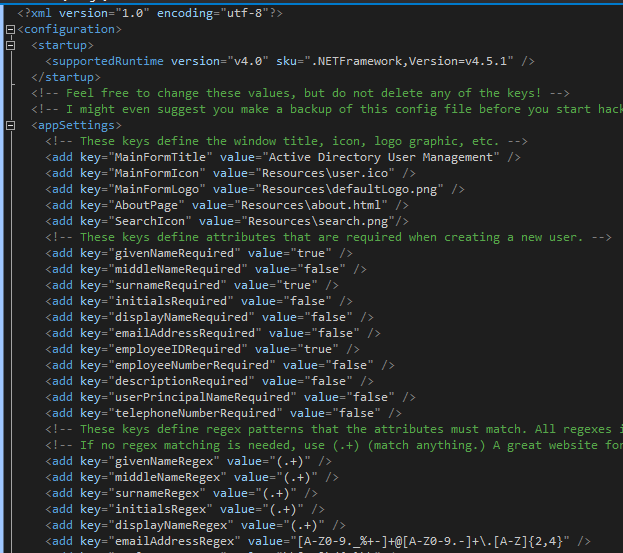

CustomAddADUser
===============

Read more here:
https://www.myotherpcisacloud.com/post/2014/06/28/customaddaduser-v10.aspx

This program is designed to supplement the Active Directory Users and Computers (ADUC) interface for adding users. One of the main advantages of using this tool to add users is that certain attributes can be made mandatory, and attributes such as Employee ID can be validated with regular expressions before allowing the user to be created. This helps ensure that data entered into the directory by administrators stays clean, consistent and compliant... without needing to modify the AD schema. Almost every characteristic of this application can be customized with the included app.config file. This means that the application can be re-branded, regular expressions tweaked, and used by any organization who can tailor the configuration file to match their own needs. In the app.config file, you will notice that each attribute can be marked as mandatory or optional by simply changing "true" to false" and vice versa. Each attribute also has a corresponding regex key. Regardless of whether the attribute is required or not, it will be validated according to its regex pattern, unless the attribute is empty.

Read more here:
https://www.myotherpcisacloud.com/post/2014/06/28/customaddaduser-v10.aspx